<h1 style="text-align: center;">Manual de Usuario para mantenimiento de laptop Dell Inspiron N4050</h1>

<h2 style="text-align: center;"><strong>Pedro Moises Churunel Guarcax</strong></h2>
<h3 style="text-align: center;"><strong>Carné 202300720</strong></h3>
<h3 style="text-align: center;"><strong>Jueves 6 de febrero de 2025</strong></h3>

Para iniciar, tener en cuenta que para este caso y en este manual específicamente, se le hace mantenimiento a una laptop marca Dell, modelo Inspiron N4050. Se hace énfasis en este punto debido a que para cada laptop el proceso de desarme es diferente. 

Ya para algunos se les quita la carcasa desde el teclado, otros desde la parte inferior por medio de tornillos, otros tienen los tornillos ocultos en las pisaderas de goma, etc. Por esa razón es que se especifica a qué laptop se le va a dar mantenimiento en este caso específico.

1. **Tener listo todas las herramientas necesarias y los químicos necesarios a usar.**

2. **Teniendo la laptop apagada, se precede a retirarle la batería.**

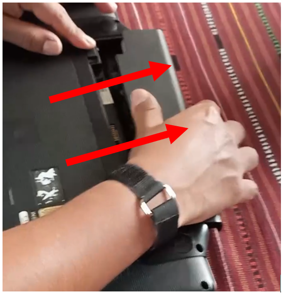

3. **Teniendo la laptop sin la batería, se procede a retirar los tornillos.** Tener cuidado de no perder los tornillos al sacarlos para que, al momento de volver a armar la laptop, quede de la mejor manera posible.

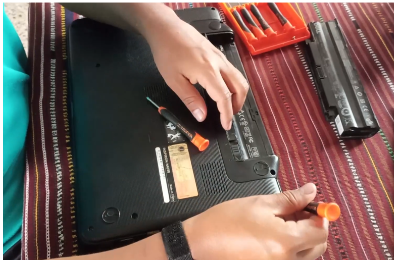

4. **Luego del paso anterior, se voltea la laptop y se procede a retirarle el teclado con mucho cuidado,** ya que se le puede dañar el cable FFC (tipo de cinta flexible que se utilizan en las laptops por su flexibilidad y porque ocupan menos espacio).

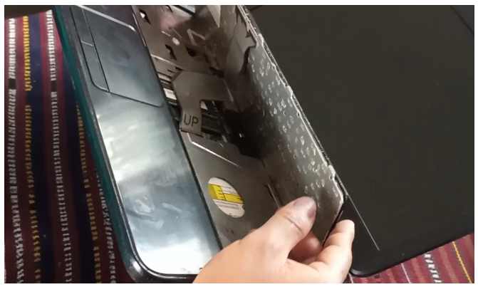

5. **El teclado se retira hacia arriba con cuidado.** El otro extremo del cable tiene un seguro que se identifica rápido porque es el único de color negro, se despliega hacia arriba y suelta automáticamente el cable.

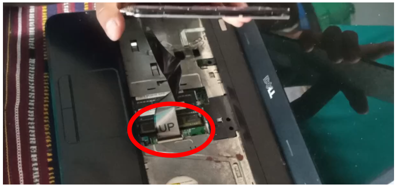

6. **Luego de retirar el teclado, se puede visualizar con facilidad las memorias RAM.** Estos dispositivos electrónicos tienen dos seguros a los lados. Para retirarlos, se empujan los seguros a los lados opuestos para que las memorias se levanten y luego se retiren extrayéndolas del lado opuesto donde estén conectados.

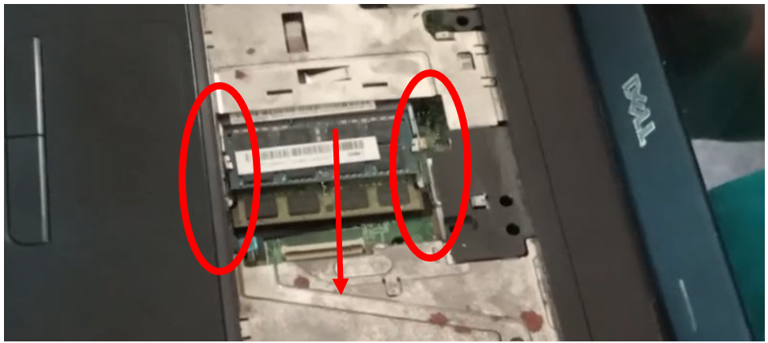

7. **Este modelo de laptop aún tiene el lector de disco, cosa que los modelos actuales ya no tienen.** Para retirar este dispositivo, hay que retirar primero un tornillo como se muestra en la imagen.

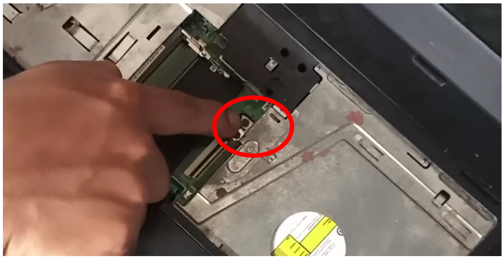

8. **Luego se empuja hacia el lado derecho.**

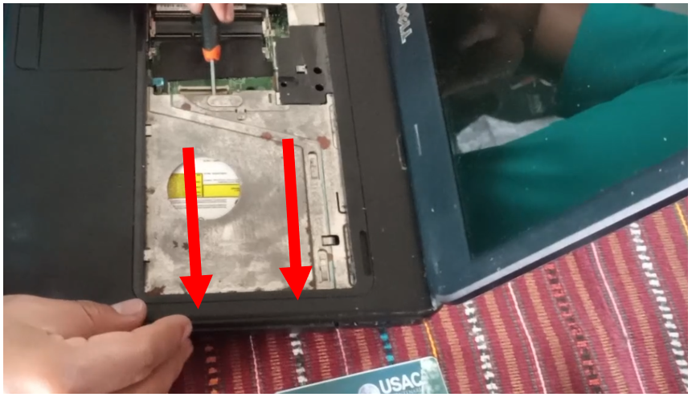

9. **Retirar los otros tres tornillos que quedan pendientes y los otros dos cables flexibles** para poder retirar la carcasa principal y de esa manera tener acceso al resto de componentes de la laptop.

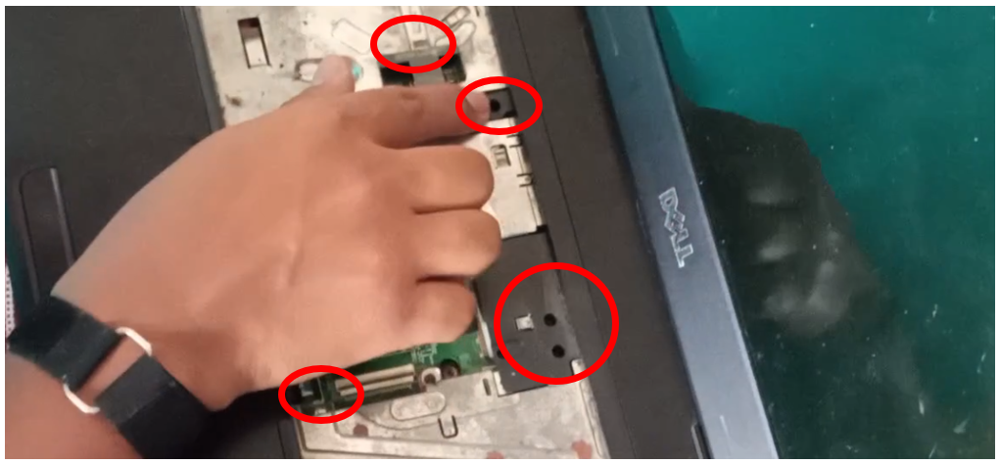

10. **Para retirar la carcasa, con dos dedos, se empuja la parte de abajo** y con el otro dedo se jala la parte de arriba para que estos se despeguen.

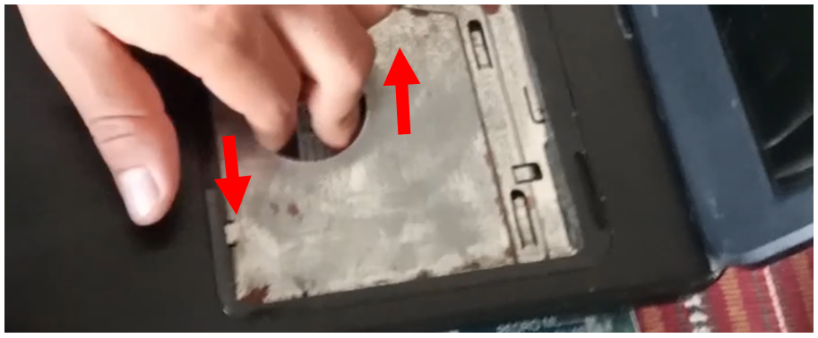

11. **A partir de este punto, es un poco más sencillo: para retirar el disco duro** solo se extrae desde el polo opuesto por donde está conectado.

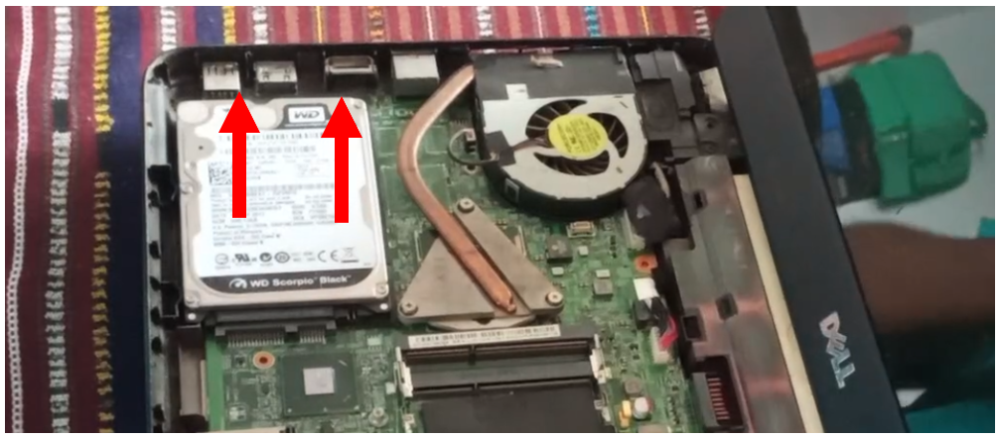

12. **Para retirar el disipador de calor y cambiar la pasta térmica del CPU, se retiran estos tres tornillos.**

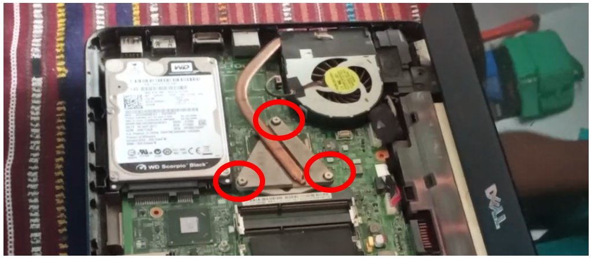

13. **Con todos estos pasos, ya podemos limpiar cada parte de la laptop.** Para armarlo, solo se regresa todo en su lugar para que funcione todo correctamente, cada tornillo, cada conector, justo como lo sacamos. Aplicamos lo inverso de cada paso, en el orden inverso, para que sea factible y que la laptop vuelva a funcionar correctamente. Y prácticamente eso sería todo para el mantenimiento.

Por último, dejo el enlace de un video tutorial para una mejor guía, donde se explica detalladamente cómo se desarma esta laptop:

[Haz clic aquí ver el video tutorial](https://youtu.be/UfjyPXzIh4g)